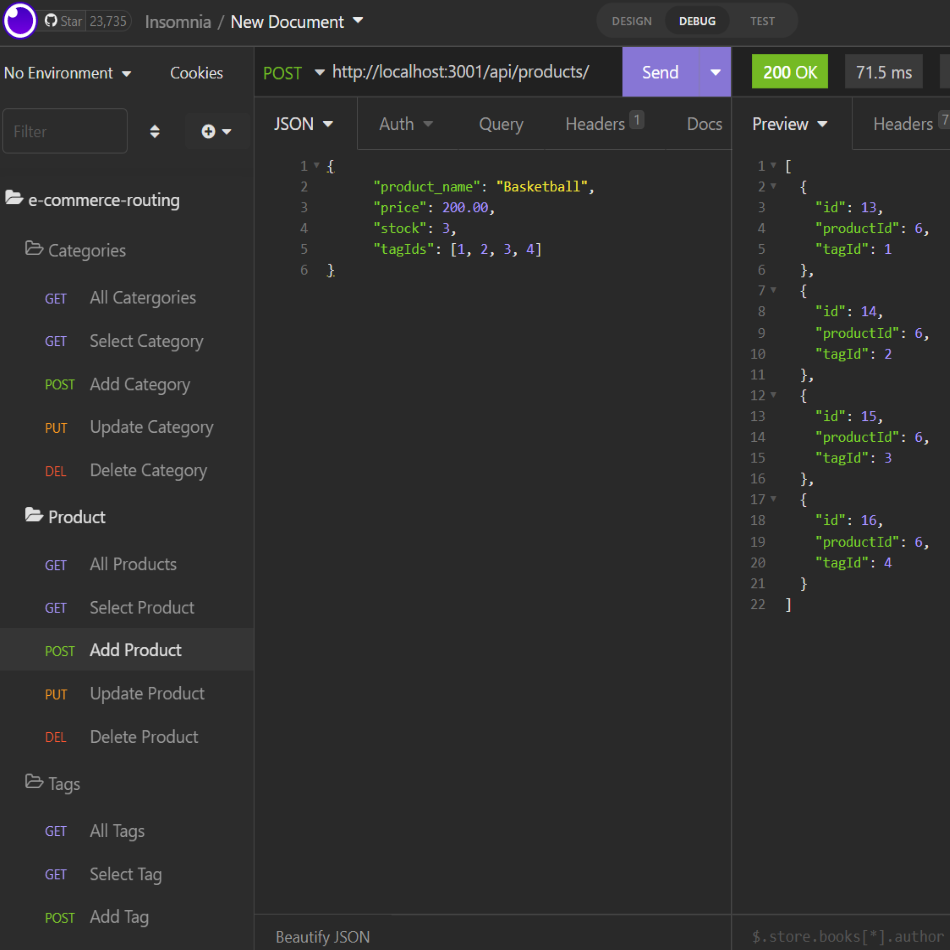

# e-commerce_routing

## Description

e-commerce_routing creates the back end routing with which to create, view, update, and delete products, catergories, and tags (staples of e-commerce).

## Table of Contents

- [Installation](#installation)
- [Usage](#usage)
- [License](#license)

## Installation

e-commerce_routing does not require installation.

e-commerce_routing is dependant on MySQL being present in the users computer. Click here to downnload MySQL.

## Usage

The user can view, add, update, and delete the following subjects: Catergories, Products, and Tags to the database. 

A catergory can have multiple products, but a product can only have one catergory. A product can have multiple tags, and a tag can have multiple products.

Below is the functionality provided alongside the appropriate routing.

- View All Catergories-
GET Request: https://example.com/api/catergories/

 - View Select Catergory-
GET Request: https://example.com/api/catergories/:id

- Add a Catergory-
POST Request: https://example.com/api/catergories/

  - With the following JSON Body:
{
    "category_name" : "sampleName"
}

- Update a Catergory-
PUT Request: https://example.com/api/catergories/:id

  - With the following JSON Body:
{
    "category_name" : "updatedName"
}

- Delete a Catergory-
DELETE Request: https://example.com/api/catergories/:id

- View All Products-
GET Request: https://example.com/api/products/

- View Select Product-
GET Request: https://example.com/api/products/:id

- Add a Product-
POST Request: https://example.com/api/products/

  - With the following JSON Body:
{
    "product_name" : "sampleName",
    "price": 200.00,
    "stock": 3,
    "tagIds": [1, 2, 3, 4]
}

- Update a Product-
PUT Request: https://example.com/api/products/:id

  - With the following JSON Body:
{
    "product_name" : "updatedName",
    "price": 200.00,
    "stock": 3,
    "tagIds": [1, 2, 3, 4]
}

- Delete a Product-
DELETE Request: https://example.com/api/products/:id

- View All Tags-
GET Request: https://example.com/api/tags/

- View Select Tag-
GET Request: https://example.com/api/tags/:id

- Add a Tag-
POST Request: https://example.com/api/tags/

  - With the following JSON Body:
{
    "tag_name" : "sampleName"
}

- Update a Tag-
PUT Request: https://example.com/api/tags/:id

  - With the following JSON Body:
{
    "tag_name" : "updatedName"
}

- Delete a Tag-
DELETE Request: https://example.com/api/tag/:id

https://drive.google.com/file/d/1Aj0TVXyV4vsB6gI8NZy9QwJ84Gl0uUKU/view

## License

MIT License

Copyright (c) [2022] [e-commerce_routing]

Permission is hereby granted, free of charge, to any person obtaining a copy
of this software and associated documentation files (the "Software"), to deal
in the Software without restriction, including without limitation the rights
to use, copy, modify, merge, publish, distribute, sublicense, and/or sell
copies of the Software, and to permit persons to whom the Software is
furnished to do so, subject to the following conditions:

The above copyright notice and this permission notice shall be included in all
copies or substantial portions of the Software.

THE SOFTWARE IS PROVIDED "AS IS", WITHOUT WARRANTY OF ANY KIND, EXPRESS OR
IMPLIED, INCLUDING BUT NOT LIMITED TO THE WARRANTIES OF MERCHANTABILITY,
FITNESS FOR A PARTICULAR PURPOSE AND NONINFRINGEMENT. IN NO EVENT SHALL THE
AUTHORS OR COPYRIGHT HOLDERS BE LIABLE FOR ANY CLAIM, DAMAGES OR OTHER
LIABILITY, WHETHER IN AN ACTION OF CONTRACT, TORT OR OTHERWISE, ARISING FROM,
OUT OF OR IN CONNECTION WITH THE SOFTWARE OR THE USE OR OTHER DEALINGS IN THE
SOFTWARE.
